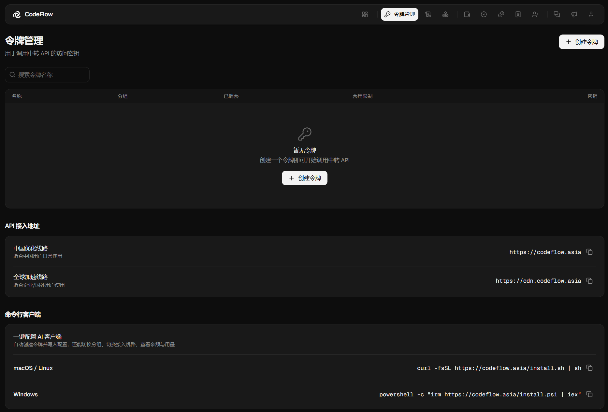

# 接入前置：Base URL 与 API 令牌

接入任何工具均需两项配置：**接口地址（Base URL）** 与 **API 令牌**。

CodeFlow 站点地址：[https://codeflow.asia/](https://codeflow.asia/)

::: info 2026 年 7 月 22 日平台升级说明
根据 CodeFlow 当时发布的升级说明，原有 `sk-` 令牌继续有效，接入地址保持不变，账户余额按 1:1 迁移，订阅剩余时长予以保留，客户端配置无需调整。历史调用明细与用量统计未迁移，消耗记录自升级日起重新累计；邀请码已更新，旧邀请链接失效；令牌不再单独提供有效期及模型或 IP 限制，仅保留费用限制。相关规则如有调整，以控制台最新公告为准。
:::

## Base URL

将客户端原有接口地址（例如 `https://api.anthropic.com`）替换为 CodeFlow 提供的兼容接口地址后，客户端将通过 CodeFlow 调用相应模型。具体支持的协议、参数和模型以 CodeFlow 控制台及对应客户端的当前版本为准。

地址在控制台 **令牌管理** 页面下方的「API 接入地址」区域获取，支持一键复制。

<EndpointCopy />

两条线路的账号、令牌与余额通用，可随时切换。

> 注意：不同客户端对 Base URL 的填写要求不同。**Claude Code、Cherry Studio（Anthropic 提供商）、Cursor-NoPro（Claude）和 OpenClaw** 使用不带 `/v1` 的地址；**Cursor-Pro、Cursor-NoPro（GPT）、Kilo Code、OpenCode 和 Codex** 使用带 `/v1` 的地址。
>
> 请勿仅根据协议类型推断地址格式。例如，OpenCode 使用 Anthropic SDK，但其 `baseURL` 仍需包含 `/v1`。请以对应客户端教程中的填写形式为准。

## API 令牌

在 **令牌管理 → 创建令牌** 中生成。

创建对话框含三个字段：

|字段|说明|
|---|---|
|名称|用于区分令牌用途。建议按客户端命名，例如 `claude-code` 或 `cursor`，便于核对用量。|
|分组|决定可调用的模型范围和计费倍率，详见下节。|
|费用限制|该令牌允许累计消费的最高金额，单位为美元。达到上限后，该令牌的请求将被拒绝；其他令牌和账户余额不受影响。留空表示不设置此项限制。|

费用限制约束的是**累计总额**，非每日额度；达到上限后在列表中调高即可，无需重建令牌。

> 注意：令牌仅在创建时完整显示一次，请立即复制并妥善保存。列表中的「密钥」字段会隐藏部分内容，无法用于恢复完整令牌。令牌丢失后，请删除原令牌并重新创建。

### 令牌保管

- 不要将令牌提交到 Git 仓库。本文示例优先使用用户级配置文件；如确需使用项目级配置，请确认相关文件已加入 `.gitignore`。
- 不要将令牌以明文写入团队模板、Docker 镜像、公开日志或会同步到 dotfiles 仓库的文件。CI/CD 场景应使用平台提供的加密 Secret，不要写入普通变量或仓库文件。
- 提交日志、截图或 issue 前请先脱敏，终端回显与报错信息中亦可能包含令牌。
- 疑似泄露时，在 **令牌管理** 中删除并重新创建，填回工具即可，原令牌立即失效，不影响余额与订阅。
- 为令牌设置「费用限制」。升级后有效期与模型／IP 限制已下线，此项为令牌层面唯一的止损手段。

## 分组与计费倍率

::: info 分组数据来源与核验
- **来源**：[CodeFlow 控制台「令牌管理」](https://codeflow.asia/tokens)的创建令牌分组选项
- **核验范围**：分组名称与计费倍率
- **最后核验日期**：2026 年 8 月 18 日

本节分组名称与倍率已在登录后的控制台逐项核对。分组可调用模型范围、号池说明和倍率可能调整，创建令牌时请以控制台实时显示为准。
:::

创建令牌时选择的分组决定可调用的模型范围、平台采用的服务线路以及**计费倍率**。实际计费金额为模型单价乘以对应分组倍率。

|分组|说明|可调用模型|计费倍率|
|---|---|---|---|
|Claude 低价分组|平台标注为 Kiro 线路|Claude 系列（`claude-*`）|×1|
|Codex 官方分组|平台标注为 Codex 官方线路|GPT 系列（`gpt-*`）|×1|
|Claude 稳定分组|平台标注为混合线路|Claude 系列（`claude-*`）|×3|
|Claude 官方分组|平台标注为 Claude 官方线路|Claude 系列（`claude-*`）|×9|

表中的线路说明来自 CodeFlow 控制台，用于区分平台提供的服务分组，不代表本站对具体上游实现作独立保证。线路名称、可用模型和倍率均可能调整，请在创建令牌时再次核对。

选择建议：

|使用场景|建议分组|
|---|---|
|优先考虑较低倍率|Claude 低价分组（×1）|
|需要平台标注的混合线路|Claude 稳定分组（×3）|
|需要平台标注的官方线路|Claude 官方分组（×9）|
|Codex／GPT 系列|Codex 官方分组（×1）|

> 注意：令牌分组必须与模型系列对应。Claude 分组用于 `claude-*` 模型，Codex 分组用于 `gpt-*` 模型。分组不匹配时，请求通常会返回模型不可用或类似错误。若需要同时使用两类模型，请分别创建令牌。
