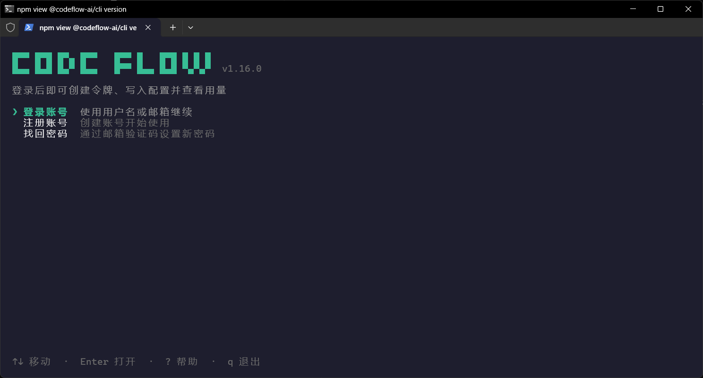
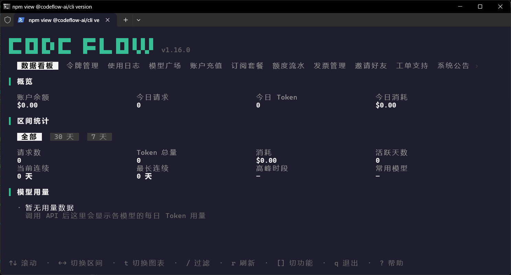
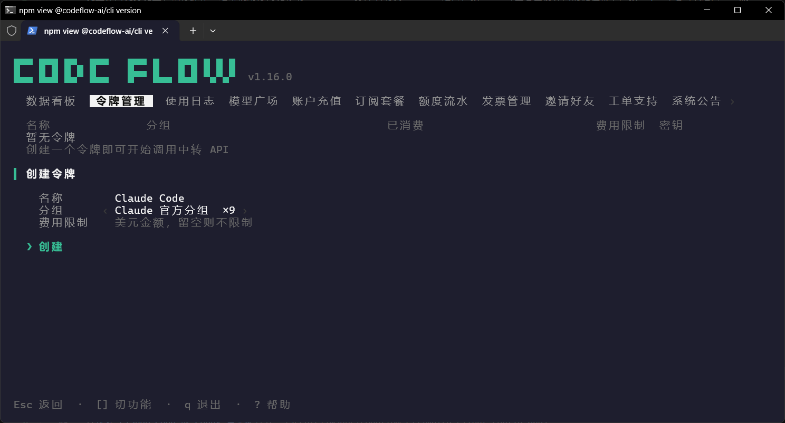
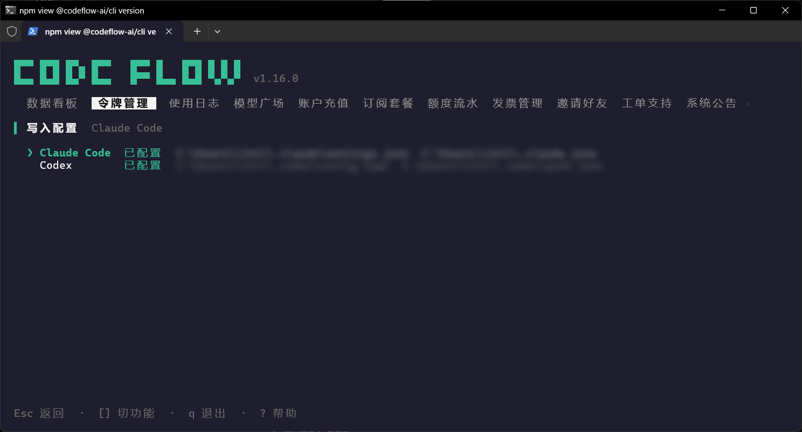

# CodeFlow 命令行工具

*最后核验：2026 年 8 月 20 日（CodeFlow CLI v1.16.0）*

CodeFlow 是官方提供的交互式命令行工具。登录后，可以直接在终端中管理 CodeFlow 账户、查看调用数据，并将现有令牌配置到 Claude Code 或 Codex。网页控制台仍可通过 [CodeFlow 官网](https://codeflow.asia/dashboard) 使用，两种入口访问的是同一账户数据。

::: warning 使用前请注意
命令行工具会读取并修改本机的 Claude Code 或 Codex 配置。写入前请确认所选令牌、分组、接入线路和默认模型正确；团队设备或已有复杂配置的设备，建议先备份对应配置文件。工具版本和界面可能更新，实际选项以当前客户端显示为准。
:::

## 安装

### macOS / Linux

在终端中运行：

```sh
curl -fsSL https://codeflow.asia/install.sh | sh
```

### Windows

在 PowerShell 中运行：

```powershell
powershell -c "irm https://codeflow.asia/install.ps1 | iex"
```

安装完成后运行：

```sh
codeflow
```

如果 PowerShell 因执行策略拒绝加载 `codeflow.ps1`，可在命令提示符中运行 `codeflow.cmd`，或按照下文的故障处理检查执行策略。

## 登录与操作

以下使用 Windows 版本演示：

首次启动时，按界面提示登录现有 CodeFlow 账户；没有账户时可在工具内注册。登录状态保存在当前用户的本地配置目录中，请勿将该目录共享给其他人。




交互界面支持键盘和鼠标操作。通常使用方向键移动、`Enter` 打开或确认、`Esc` 返回；按 `?` 可查看当前界面的键位帮助，按 `q` 可退出或返回上一级。



> 终端界面会随窗口尺寸和工具版本变化。本文截图依据 CodeFlow CLI v1.16.0 的当前菜单与字段整理。

## 账户与数据管理

登录后，可以在命令行界面中使用以下功能：

|功能|可执行的操作|
|---|---|
|数据看板与用量|查看账户余额、请求与 Token 用量，以及按模型汇总的用量趋势|
|令牌管理|创建、修改、删除令牌，设置分组与费用限制，并选择 API 接入线路|
|使用日志|按条件筛选调用记录，核对模型、Token 用量、费用和请求状态|
|模型广场|查询模型 ID、价格、缓存计费和当前可用情况|
|账户充值|选择充值套餐或自定义金额，并查看充值记录|
|订阅套餐|查看、购买或续费套餐，并管理额度用尽后的计费偏好|
|额度流水|核对充值、消费、退款、奖励及其他额度变动|
|发票管理|管理开票信息、提交申请并查看处理状态|
|邀请好友|查看邀请码、邀请记录和奖励额度|
|工单支持|创建工单、查看回复并继续跟进问题|
|系统公告|阅读平台通知和维护公告|

充值、订阅、退款、发票和邀请规则可能调整。执行相关操作前，请以命令行工具或网页控制台实时显示的金额、状态和说明为准。

## 一键配置 Claude Code 与 Codex

在 **令牌管理** 中按 `n` 新建令牌，填写名称、选择分组，并按需设置费用限制。完整令牌只显示一次，创建后应立即复制并妥善保存。



令牌创建完成后，选择 **写入配置**，再选择 Claude Code 或 Codex。工具会先读取本机现有配置，显示将要修改的文件，并标明客户端是否已经配置。



### Claude Code

选择 **Claude Code** 后，工具会把当前接入地址和令牌写入 Claude Code 的用户配置，分别对应 `ANTHROPIC_BASE_URL` 与 `ANTHROPIC_AUTH_TOKEN`。默认使用 `~/.claude/settings.json`；如设置了 `CLAUDE_CONFIG_DIR`，则使用该目录。

### Codex

选择 **Codex** 后，先从当前令牌可用的模型中选择默认模型。工具随后更新 `~/.codex/config.toml` 中的模型供应商、接入地址和默认模型，并将令牌写入 `~/.codex/auth.json`。如设置了 `CODEX_HOME`，则使用该目录。

工具为 Codex 使用带 `/v1` 的接入地址，并按 Responses 协议写入供应商配置。原配置不是合法 JSON 或 TOML，或文件结构无法安全合并时，工具会停止写入并提示先修复文件。

::: tip 配置建议
为 Claude Code 和 Codex 分别创建令牌，并使用清晰的名称。这样可以分别核对使用日志、设置费用限制，也便于在单个客户端出现异常时撤销对应令牌。
:::

## 更新与卸载

查看当前工具提供的命令：

```sh
codeflow help
```

检查并安装新版本：

```sh
codeflow update
```

卸载工具：

```sh
codeflow uninstall
```

`codeflow uninstall` 会退出登录、删除 CodeFlow CLI 的本地文件，并卸载程序。它不会作为普通的升级步骤使用；需要更新时优先运行 `codeflow update` 或重新执行安装命令。

## 遇到问题怎么办

|现象|大致处理方式|
|---|---|
|安装后提示找不到 `codeflow`|关闭并重新打开终端，确认安装脚本提示成功；仍不可用时检查 npm 全局命令目录是否已加入 `PATH`。|
|PowerShell 提示禁止运行脚本|在命令提示符中运行 `codeflow.cmd`；如需调整 PowerShell 执行策略，请先了解其安全影响，并仅对当前用户使用合适的策略。|
|提示尚未登录或登录已失效|重新运行 `codeflow` 并登录；启用了两步验证时，同时准备动态验证码或恢复码。|
|创建令牌后没有可用模型|返回令牌管理，确认令牌分组与目标模型系列匹配；模型与分组以当前模型广场和创建令牌界面为准。|
|写入 Claude Code 或 Codex 配置失败|根据提示修复对应 JSON 或 TOML 文件；已有重要配置时先备份，再参照 [Claude Code](../tools/claude-code.md) 或 [Codex](../tools/codex.md) 指南手动核对。|
|配置成功但客户端请求失败|检查接入线路、令牌分组、默认模型和账户额度，并在使用日志中核对具体状态；仍无法解决时通过工单支持提交发生时间、模型和请求 ID。|
