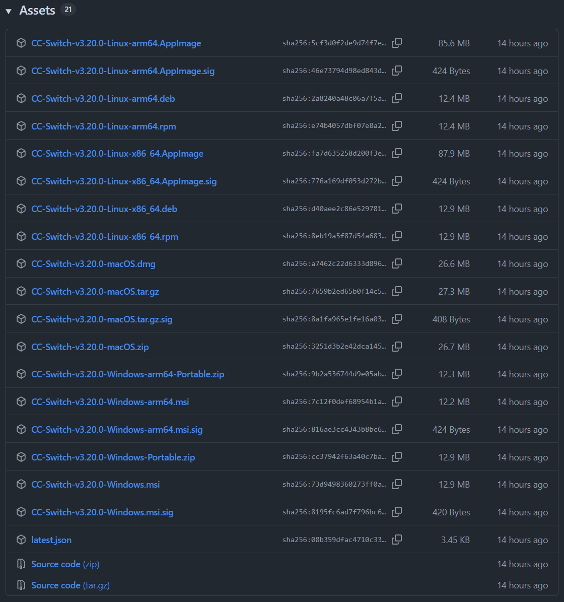
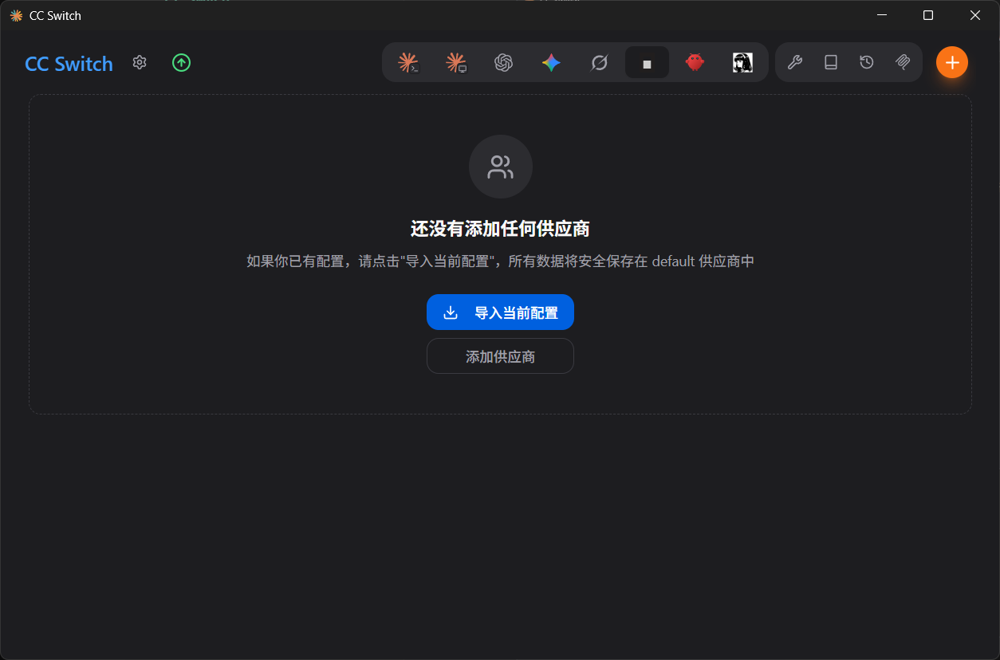
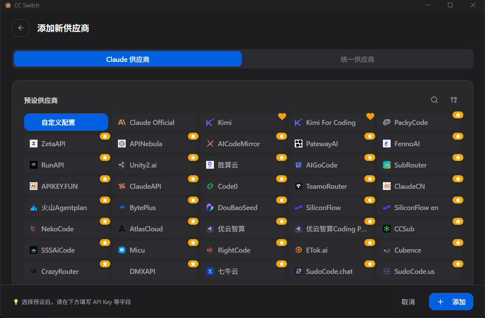
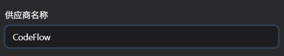
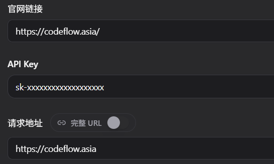
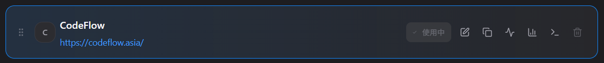
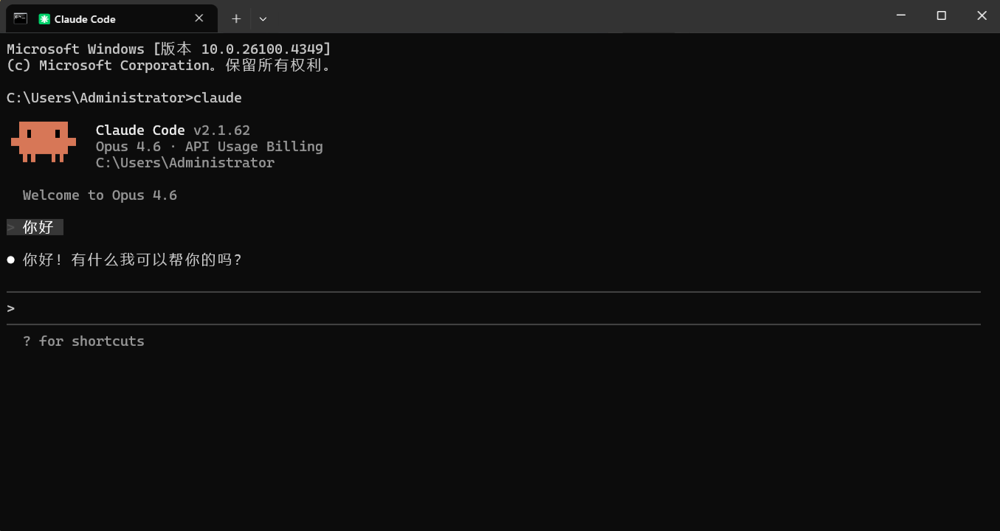

# CC Switch 配置指南

*最后更新：2026 年 8 月 20 日 02:55*

::: warning 配置时效性
本文依据截至 2026 年 8 月 20 日可获取的客户端界面和 CodeFlow 配置信息整理。客户端界面、配置字段、模型 ID 和可用分组可能随版本更新而变化；实际填写请以客户端最新版本和 CodeFlow 控制台为准。
:::

CC Switch 是供应商配置管理工具，可通过图形界面管理 Claude Code 和 Codex 的连接配置，并在多个供应商之间切换。若不希望手动编辑配置文件，可使用本方式。

## 1. 准备客户端

1. 前往 [CC Switch GitHub Releases 页面](https://github.com/farion1231/cc-switch/releases/latest)，查看并下载最新版本。

2. 在最新版本的 **Assets** 区域选择适用于当前系统的安装包：Windows 推荐下载 `.msi` 文件，macOS 选择 `.dmg` 文件，Linux 可按需选择 AppImage、deb 或 rpm 格式。



## 2. 打开配置入口

打开已安装的 CC Switch。



在分组条中选择要配置的客户端。


## 3. 填写 CodeFlow 配置

在对应分组右侧点击「+」添加供应商；如果按钮不可见，请先将窗口最大化。选择「自定义配置」，然后填写供应商名称和配置内容。



将供应商名称填写为 `CodeFlow`。



填入配置内容。



`sk-xxxxxxxx` 仅为占位符，请替换为实际令牌。

Claude 配置模板如下：

```json
{
  "env": {
    "ANTHROPIC_BASE_URL": "https://codeflow.asia",
    "ANTHROPIC_AUTH_TOKEN": "sk-您的令牌"
  }
}
```

配置 Codex 时选择 `Codex` 分组，并使用带 `/v1` 的 CodeFlow 地址：`https://codeflow.asia/v1`。模型 ID 和令牌字段按 CC Switch 当前表单填写；如需配置 `config.toml` 和 `auth.json`，请参阅 [Codex 配置指南](./codex.md)。

## 4. 保存并启用

添加成功后，在主界面找到刚创建的供应商，点击「启用」，直到状态显示「使用中」。



## 5. 验证连接

Claude 供应商可在终端运行 `claude`，Codex 供应商可运行 `codex`。出现对话界面并能正常回复，即表示配置完成。下图为 Claude Code 的验证示例。



## 遇到问题怎么办

| 现象 | 大致处理方式 |
|---|---|
| 找不到「+」或「自定义配置」 | 最大化窗口并确认当前客户端分组与要配置的软件一致。 |
| Claude 返回 401 | 检查 `ANTHROPIC_AUTH_TOKEN` 是否有效，且 `ANTHROPIC_BASE_URL` 不带 `/v1`。 |
| Codex 返回 401 或 404 | 检查 `auth.json`、`config.toml` 和模型 ID，并确认令牌属于 Codex 官方分组。 |
