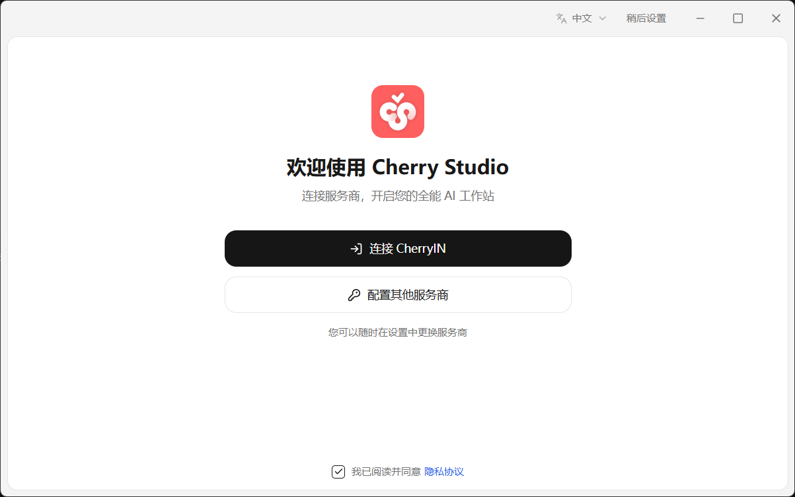
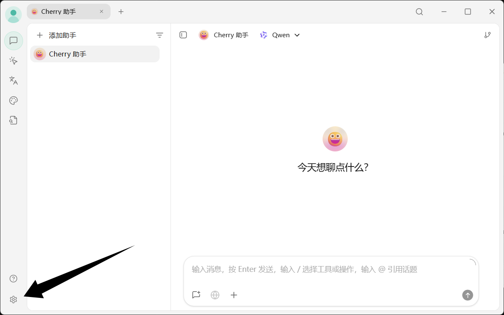
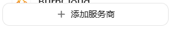
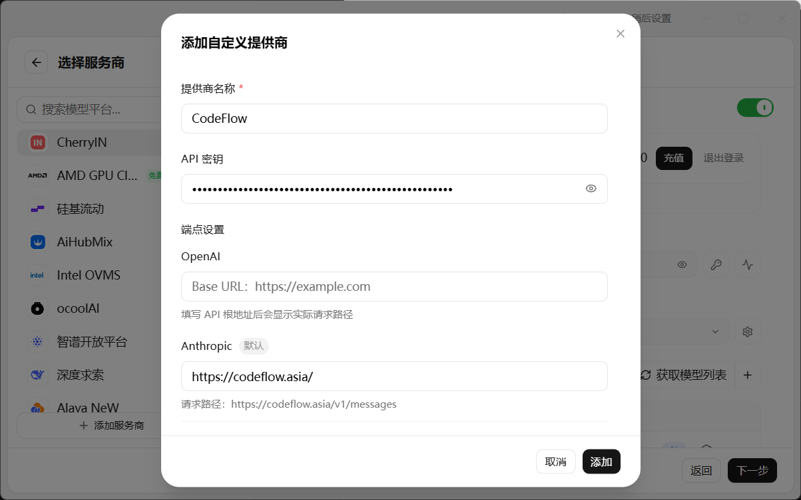
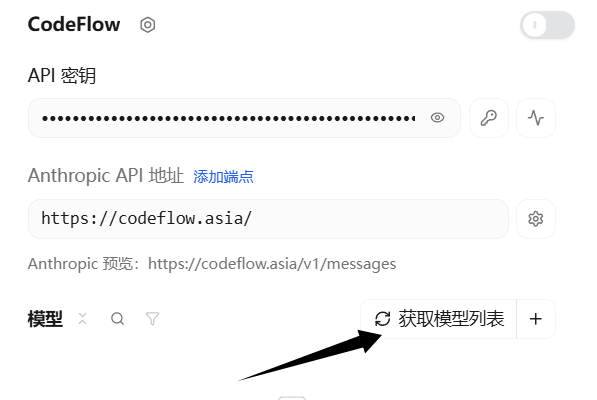
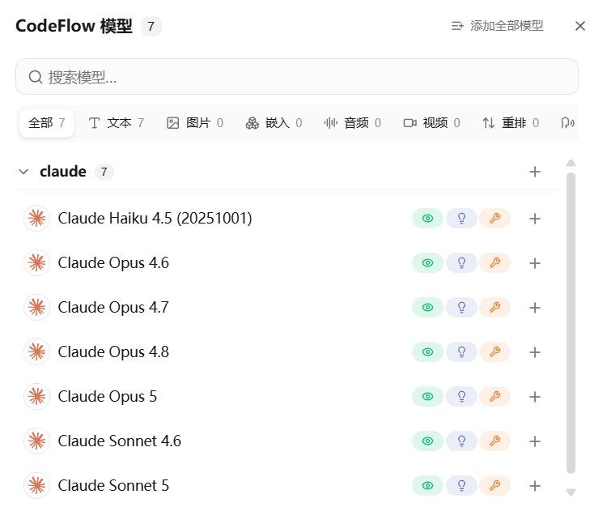

# Cherry Studio 配置指南

*最后更新：2026 年 8 月 20 日 02:55*

::: warning 配置时效性
本文依据截至 2026 年 8 月 20 日可获取的客户端界面和 CodeFlow 配置信息整理。客户端界面、配置字段、模型 ID 和可用分组可能随版本更新而变化；实际填写请以客户端最新版本和 CodeFlow 控制台为准。
:::

## 1. 准备客户端

请从 [Cherry Studio 官方网站](https://www.cherry-ai.com/) 下载并启动客户端。

按客户端提示使用邮箱注册或登录 Cherry Studio。

## 2. 打开配置入口

点击左下角的「添加服务商」。

## 3. 填写 CodeFlow 配置

提供商列表通常包含 `OpenAI` 和 `Anthropic`。以下以 `Anthropic` 为例。

|配置项 | 填写内容 |
|---|---|
|提供商类型 | `Anthropic` |
|Base URL | `https://codeflow.asia`（不带 `/v1`） |
|API 密钥 | 您的 CodeFlow 令牌 |
|令牌分组 | Claude 系列分组 |

配置完成后，在右侧供应商详情中点击「获取模型列表」。

如需使用 `OpenAI` 端点，请在 `OpenAI` 提供商中将 Base URL 填写为 `https://codeflow.asia/v1`，并使用 Codex 官方分组令牌。

从返回的列表中选择需要使用的模型。

## 4. 保存并启用

在供应商详情中点击右上角的启用选项。

## 5. 验证连接

新建对话并发送一条测试消息，能够正常返回内容即表示配置完成。

## 遇到问题怎么办

| 现象 | 大致处理方式 |
|---|---|
| 获取模型列表为空 | 确认提供商类型为 `Anthropic`、Base URL 不带 `/v1`，并检查令牌分组是否包含 Claude 模型。 |
| 返回 401 | 重新复制 CodeFlow 令牌，并确认令牌没有多余空格且分组正确。 |
