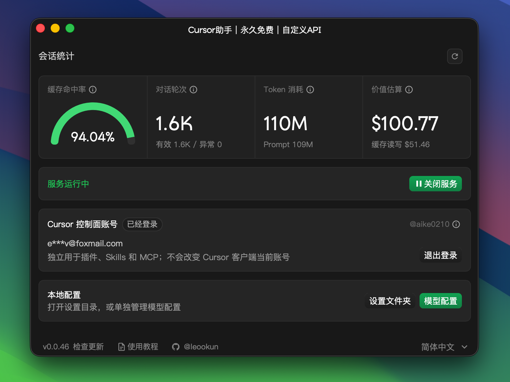

# Cursor-NoPro 配置指南

*最后更新：2026 年 8 月 20 日 02:55*

::: warning 配置时效性
本文依据 Cursor 当前的第三方模型接入限制、CodeFlow 接口和 cursor-byok-no-ads v0.0.48 整理。Cursor 或第三方工具更新后，界面、兼容性和配置字段可能变化；模型 ID 与令牌分组请以 CodeFlow 控制台当前显示为准。
:::

受 Cursor 当前账号权限和 BYOK 实现限制，没有 Cursor Pro 或更高等级订阅的账号无法仅通过内置配置入口完整使用第三方模型。本页使用第三方项目 [cursor-byok-no-ads](https://github.com/khiqwq/cursor-byok-no-ads) 在本机运行模型网关，再将 Cursor 的 Agent 请求转发到 CodeFlow。

::: danger 使用第三方工具前请确认
cursor-byok-no-ads 不是 Cursor 或 CodeFlow 的官方产品。它会处理 Cursor 会话请求并在本机保存 API Key，模型请求仍会发送到 CodeFlow。请只从项目 Release 下载，核对版本与文件来源，并在团队设备上遵循组织的安全要求。无法接受该信任边界时，请勿使用此方案。
:::

## 1. 准备客户端

1. 从 [Cursor 官方网站](https://cursor.com/cn) 安装最新版本，并登录现有账号。
2. 在 CodeFlow **令牌管理**中为 Cursor 单独创建令牌。使用 `gpt-*` 模型时选择 Codex 官方分组；使用 `claude-*` 模型时选择 Claude 系列分组。
3. 从模型广场复制准备使用的模型 ID。不要直接沿用本文或截图中的示例模型。

如果拥有 Cursor Pro 或更高等级订阅，并希望使用客户端原生配置入口，请改用 [Cursor-Pro 配置指南](./cursor.md)。

## 2. 安装 cursor-byok-no-ads

打开项目的 [GitHub Releases](https://github.com/khiqwq/cursor-byok-no-ads/releases/latest)，按系统架构下载最新构建：

|操作系统|v0.0.48 构建文件|
|---|---|
|Windows x86-64|`windows-amd64.zip`|
|macOS Apple Silicon|`macos-arm64.dmg`|
|macOS Intel|`macos-amd64.dmg`|
|Linux x86-64|`linux-amd64.tar.gz`|

解压或安装后启动 cursor-byok。macOS 构建采用临时签名且未经 Apple 公证；如系统阻止启动，请先核验项目、Release 和文件摘要，再决定是否继续，不要在无法确认来源时绕过系统安全提示。

## 3. 填写 CodeFlow 配置

在 cursor-byok 主界面选择 **模型配置 → 新增模型**，根据模型系列填写：

|配置项|GPT 模型|Claude 模型|
|---|---|---|
|类型|`OpenAI`|`Anthropic`|
|接口地址|`https://codeflow.asia/v1`|`https://codeflow.asia`|
|访问密钥|Codex 官方分组令牌|Claude 系列分组令牌|
|显示名称|自定义易识别的名称|自定义易识别的名称|
|模型标识|模型广场中的 `gpt-*` ID|模型广场中的 `claude-*` ID|
|接口端点|`/v1/responses`|无需选择|

填写接口地址和访问密钥后，可以使用 **获取模型** 查询服务端模型列表；也可以直接填写模型 ID。上下文窗口、最大输出 Token、推理强度和额外参数没有明确需要时保持默认值。

选择 **保存并测试**。测试通过后保存配置；测试失败时先展开原始返回，核对状态码和错误信息。

> 截图来自项目提供的中文界面示例，所示模型仅用于展示界面，不代表 CodeFlow 当前可用模型。实际字段和按钮以已安装版本为准。

## 4. 保存并启用

返回 cursor-byok 主界面，确认模型已经保存，然后选择 **启动服务**。状态显示为 **服务运行中** 后保持 cursor-byok 运行；关闭本地服务后，Cursor 将无法继续通过该网关调用第三方模型。

项目说明中将该工具定义为 Cursor 后端的本地实现，负责协议适配、模型请求转发、工具调用衔接和会话状态管理。API Key 与应用设置保存在本机，模型请求发送到所配置的 CodeFlow 接口。

## 5. 验证连接

完全退出并重新打开 Cursor，在 Agent 的模型选择器中选择刚配置的模型，然后发送一条测试消息。模型能够正常回复，且工具调用可以执行，即表示接入完成。

首次使用时建议同时查看 CodeFlow **使用日志**：确认请求使用了预期模型、令牌和分组，并核对 Token 用量与费用。

## 遇到问题怎么办

|现象|大致处理方式|
|---|---|
|Cursor 中没有出现配置的模型|确认 cursor-byok 显示“服务运行中”，然后完全退出并重新打开 Cursor。Cursor 更新后仍不可用时，检查项目是否已发布兼容版本。|
|模型测试返回 401|重新填写访问密钥，并确认令牌没有被删除、禁用或复制出多余空格。|
|模型测试返回 404|从模型广场重新复制模型 ID；GPT 模型确认接口地址带 `/v1` 且端点为 `/v1/responses`。|
|测试通过但 Cursor 请求失败|保持 cursor-byok 运行，检查模型类型、令牌分组与模型系列是否匹配，并在 CodeFlow 使用日志中核对请求状态。|
|本地服务无法启动|关闭重复运行的 cursor-byok 实例，检查安全软件或端口占用；运行日志位于 `~/.cursor-local-assistant-v2/logs/`。|
|macOS 阻止打开应用|该版本未经 Apple 公证。先核验 Release 文件摘要并评估风险；无法确认来源时不要绕过 Gatekeeper，可选择审查源码后自行构建。|

项目来源：[khiqwq/cursor-byok-no-ads](https://github.com/khiqwq/cursor-byok-no-ads)。该项目基于 MIT 许可的 [leookun/cursor-byok](https://github.com/leookun/cursor-byok) 修改，并声明移除了上游广告服务、缓存和入口。
