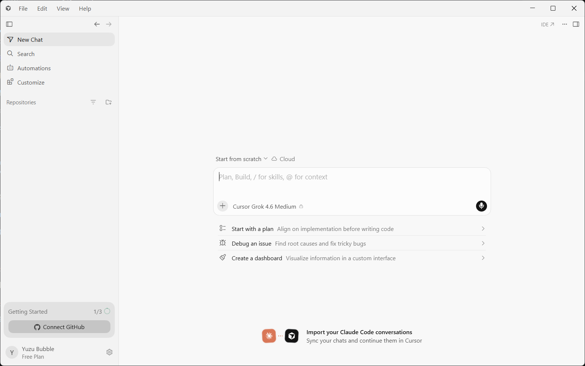
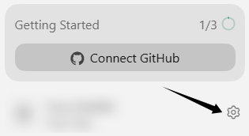
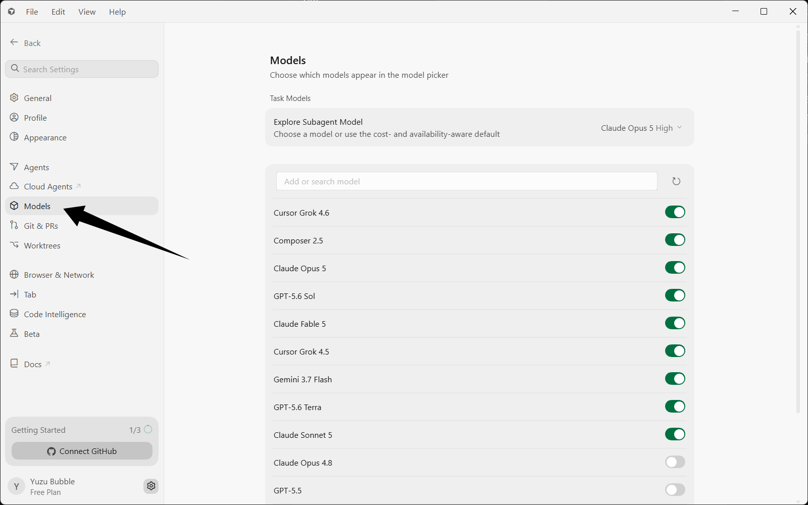
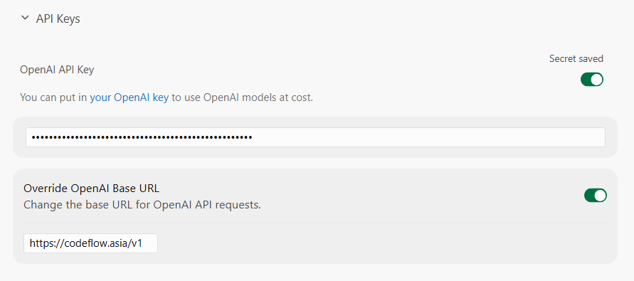
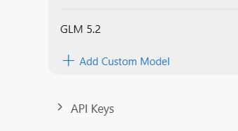
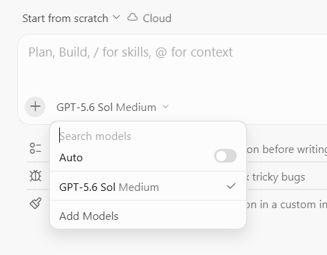

# Cursor-Pro 配置指南

*最后更新：2026 年 8 月 20 日 02:55*

::: warning 配置时效性
本文依据截至 2026 年 8 月 20 日可获取的客户端界面和 CodeFlow 配置信息整理。客户端界面、配置字段、模型 ID 和可用分组可能随版本更新而变化；实际填写请以客户端最新版本和 CodeFlow 控制台为准。
:::

本页适用于拥有 Cursor Pro 或更高等级订阅的用户，并使用 Cursor 内置的 API Key 配置入口。没有相应订阅时，请参阅 [Cursor-NoPro 配置指南](./cursor-nopro.md)。

## 1. 准备客户端
1. 前往 [Cursor 官方页面](https://cursor.com/cn)，点击右上角的「下载」按钮，安装并启动最新版本。

2. 按客户端提示使用邮箱注册或登录 Cursor。

## 2. 打开配置入口

点击左下角的设置按钮，进入配置页面。

在设置页选择左侧的 `Models` 选项卡。

## 3. 填写 CodeFlow 配置

在 `Models` 页面向下滚动，找到并展开 `API Keys` 区域。

在 `API Keys` 区域启用 `OpenAI API Key` 和 `Override OpenAI Base URL`，并填写下表中的令牌和地址。

|配置项|填写内容|
|---|---|
|Override OpenAI Base URL|`https://codeflow.asia/v1`|
|OpenAI API Key|您的 CodeFlow 令牌|
|令牌分组|调用 `gpt-*` 选 Codex 官方分组；调用 `claude-*` 选 Claude 系列分组|

## 4. 保存并启用

返回上方的 `Models` 区域，点击 `Add Custom Model`。

填写需要使用的模型 ID。具体 ID 应以 CodeFlow 模型广场当前标注的值为准。

添加完成后，确认该模型处于启用状态。

## 5. 验证连接

回到会话选择刚启用的模型，发送测试消息并确认能够正常返回。

## 遇到问题怎么办

| 现象 | 大致处理方式 |
|---|---|
| 模型不可用或列表为空 | 确认 Base URL 为 `https://codeflow.asia/v1`，并检查模型 ID 是否来自当前模型广场。 |
| 返回 401 | 重新填写 CodeFlow 令牌，并确认令牌分组与模型系列匹配。 |
