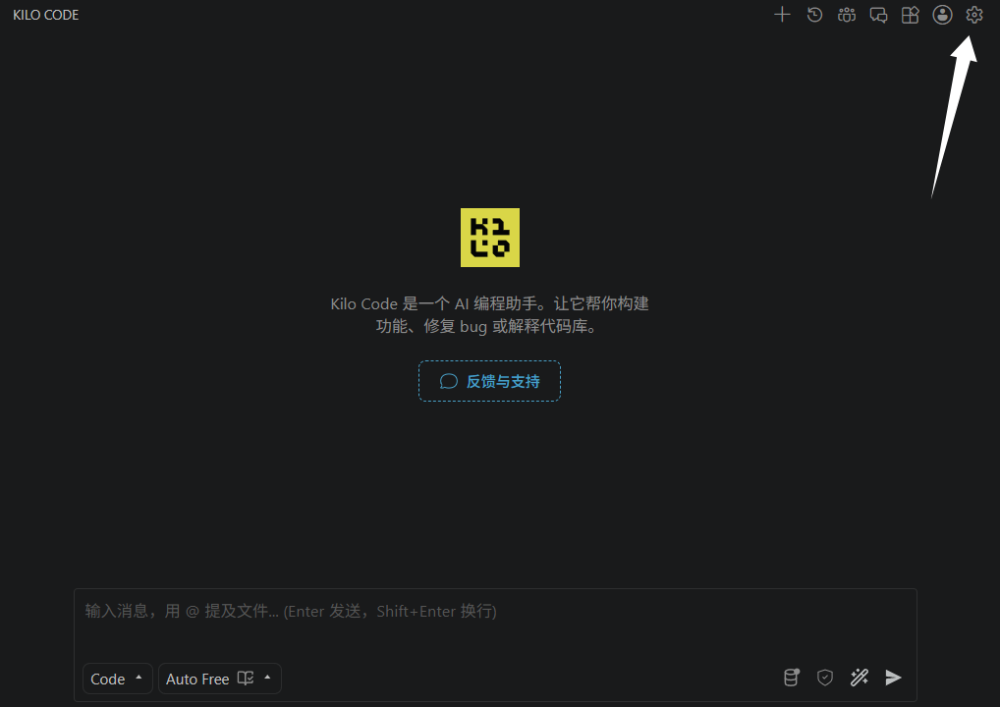
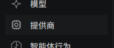
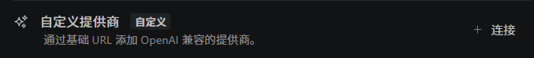
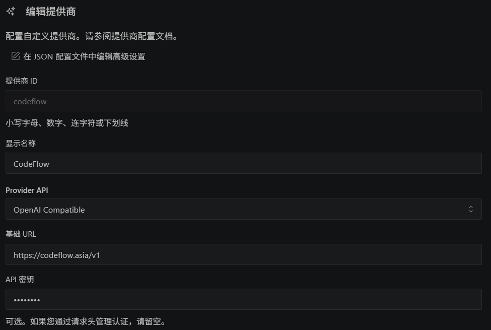
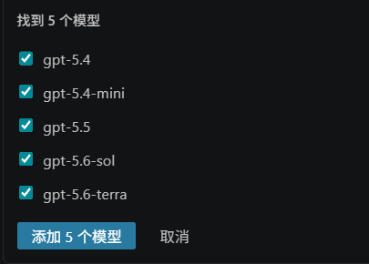

# Kilo Code 配置指南

*最后更新：2026 年 8 月 20 日 02:55*

::: warning 配置时效性
本文依据截至 2026 年 8 月 20 日可获取的客户端界面和 CodeFlow 配置信息整理。客户端界面、配置字段、模型 ID 和可用分组可能随版本更新而变化；实际填写请以客户端最新版本和 CodeFlow 控制台为准。
:::

## 1. 准备客户端

在 VS Code 的扩展市场中搜索 `Kilo Code`，安装并启动扩展。

## 2. 打开配置入口

进入 Kilo Code 扩展，点击右上角的「设置」。

选择左侧的「提供商」选项卡。

在「提供商」选项卡中找到「自定义服务商」，点击右侧的「连接」按钮。

## 3. 填写 CodeFlow 配置

| 配置项 | 填写内容 |
|---|---|
| 提供商 ID | `codeflow` |
| Provider API | `OpenAI Compatible` |
| 基础 URL | `https://codeflow.asia/v1` |
| API 密钥 | 您的 CodeFlow 令牌 |
| 令牌分组 | 按需选择，决定可获取的模型范围 |

填写「基础 URL」和「API 密钥」后，Kilo Code 会尝试获取当前分组可用的模型。选择需要使用的模型并添加。

## 4. 保存并启用

确认供应商和模型信息无误后，点击页面中的保存或提交按钮。

## 5. 验证连接

选择已添加的模型并发送测试消息，能够正常回复即表示配置完成。

## 遇到问题怎么办

| 现象 | 大致处理方式 |
|---|---|
| 获取不到模型 | 确认基础 URL 带 `/v1`，并检查令牌分组与所选模型系列一致。 |
| 测试消息失败 | 重新复制 API 密钥，保存配置后重新选择模型并发送测试消息。 |
